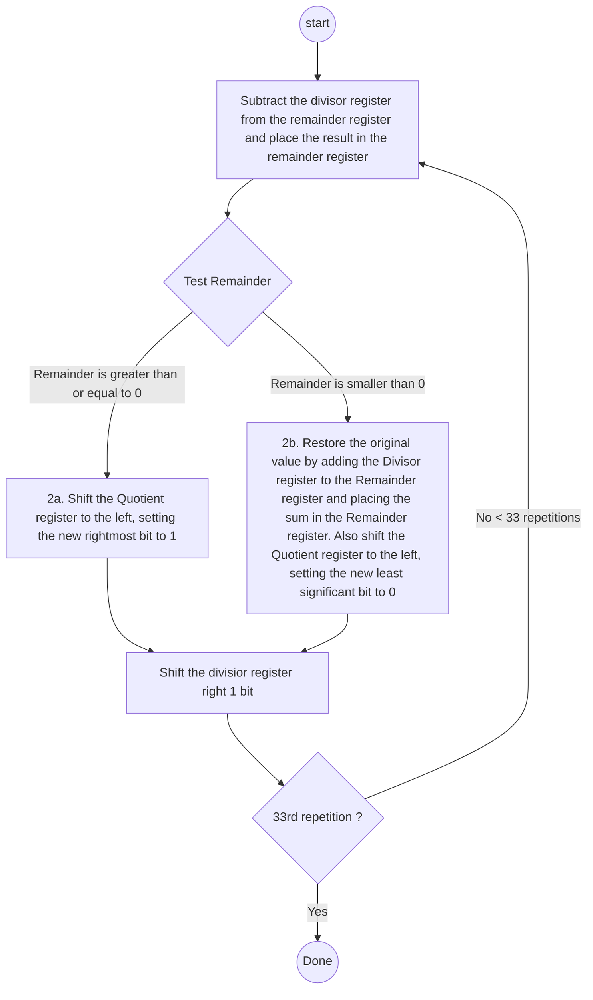

### Divide
During elementary school time, we learned how to divide numbers and this operation is less frequently used than multiply operation but much more quirky.

However, the essence of implementation of divide operation is not that different from our way of `do-it-by-hand` method.

$$Dividend=Divisor\times Quotient+Remainder$$

Suppose that we can represent given numbers in n-bit array. 
(In this example, we will only consider `unsigned integer` to merely check out how this operation works)

##### Simple Implementation : Based on subtraction
Flow chart below is summarization of simple (or naive) version of divide operation implementation.


When given numbers can be represented into N-bit arrays, we should repeat the operation for N + 1 times. Therefore, given flowchart assumes that we represent numbers with 32-bit registers.

Merely seeing flowchart will be not that helpful for understanding how it actually works.
Thus, let's see simple example : `7 divided by 2`.

7 and 2 can be represented like following

```markdown
Numbers represented in binary
7 = 0111
2 = 0010
```

| Iteration | Quotient |  Divisor  | Remainder |
| :-------: | :------: | :-------: | :-------: |
|     0     |   0000   | 0010 0000 | 0000 0111 |
|     1     |   0000   | 0001 0000 | 0000 0111 |
|     2     |   0000   | 0000 1000 | 0000 0111 |
|     3     |   0000   | 0000 0100 | 0000 0111 |
|     4     |   0001   | 0000 0010 | 0000 0011 |
|     5     |   0011   | 0000 0001 | 0000 0001 |

As it is represented as 4-bit array, we have to iterate for five times. In result, we get 3 as quotient, and 1 as remainder for given divide operation.

##### Optimized Implementation
